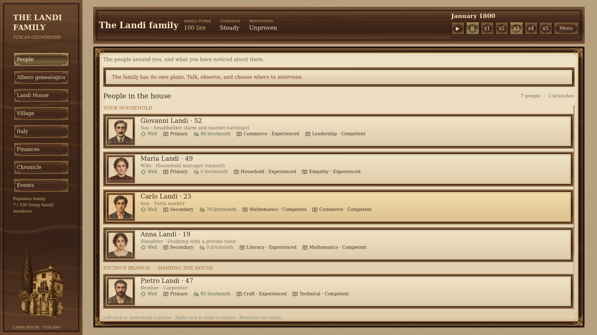
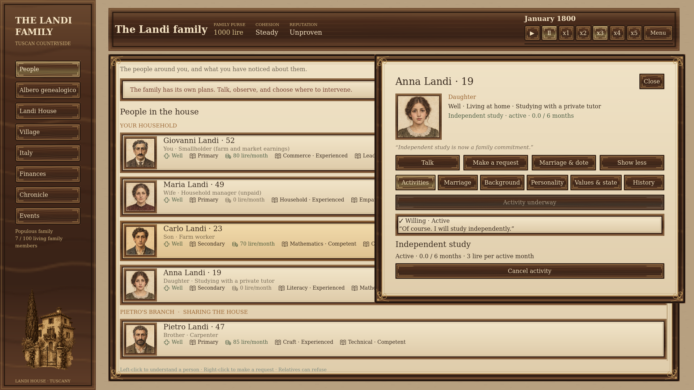
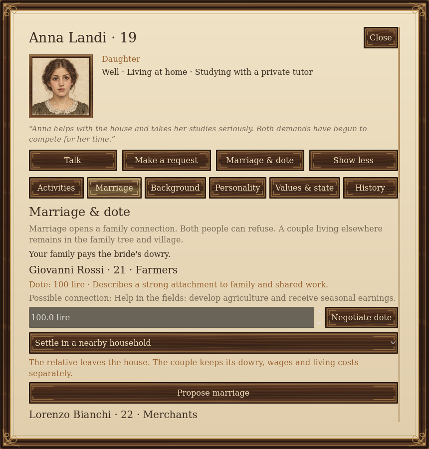
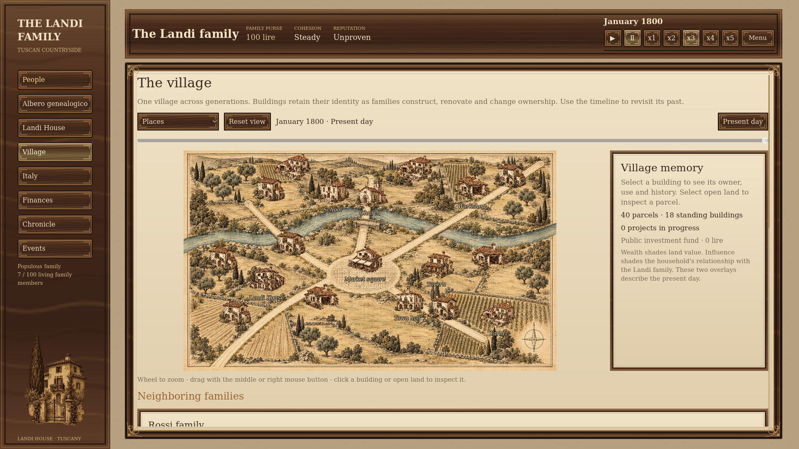

# The House

**Lead a family. Learn what matters to them. Live with the consequences.**

The House is a single-player family strategy prototype set in Tuscany, beginning in 1800. You are the head of the Landi family, sharing **Landi House** with relatives who have their own hopes, loyalties and plans. You can ask, negotiate and offer support—but they decide how to respond.

## People are your strategy

Talk to relatives, notice their concerns, and build your understanding of them. Help someone study, find work, care for the house or explore opportunities in another city. A useful arrangement today may become a source of resentment years later.

Routine requests show an immediate reaction beside the controls: **Enthusiastic, Willing, Reluctant, or Refused**. Agreement is only the beginning—people can struggle or abandon a task later.

Time advances month by month. Project updates arrive as notifications; major decisions pause the game so you can decide what to do.

## Marriage changes the family's future

Compare potential spouses from farming, merchant, artisan, landowner and educated families. Negotiate the **dote**, consider what your relative wants, and decide where the couple could live. They can accept willingly, agree reluctantly, or refuse.

A daughter's dowry leaves the shared purse. A son's bride can bring a dowry into Landi House if there is room for the couple. That money belongs to their future: if they move out, it follows them.

Marriage also opens a connection to another family. Ask for help with trade, repairs, education or introductions. Help depends on the relationship and may require something in return. Couples living nearby remain part of your family, and can have children of their own.

## A home in a changing village

Manage Landi House's space and condition, watch the shared finances, visit neighbors and develop property. The village changes as other families pursue their own ambitions. The family tree and Chronicle help you follow the lives and choices behind those changes.

## Start playing

1. Open `project.godot` in Godot 4.3 or newer and press **F5**.
2. Choose a family ambition and a starting bonus.
3. Select a portrait to meet someone. Try **Talk**, **Make a request**, or **Marriage & dote**.
4. Use the time controls to advance the story, and **Save** to keep your family.

This is a work-in-progress prototype. Marriage, children, education, careers, property and travel are playable; full succession and richer inheritance are still planned.

For setup, controls, simulation details and tests, see the [development guide](Docs/Development-Guide.md). The [marriage model](Docs/Marriage-and-Dowry.md) explains dowry and family favors; the [roadmap](todo/README.md) describes what comes next.
